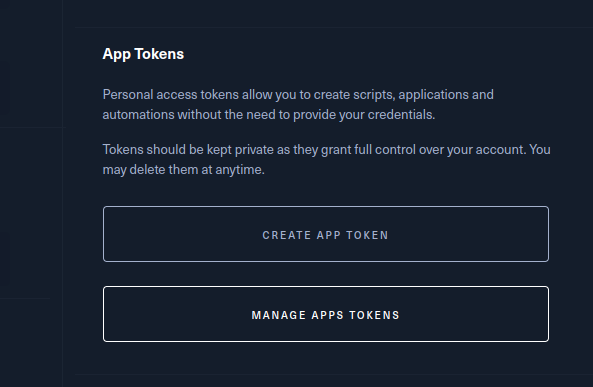

# Haxtools

A tool which makes your hacking life more convenient. Like do you find VPN setups and starting HackTheBox challenges tedious ? Or maybe opening a bunch of pentesting tools manually is a hassle? Well, i do :D... that's why i made this to simplify all that. Enjoy!

# Installation

Simply run the `install.sh` script.

```bash
git clone https://github.com/hackernese/Haxtools
cd Haxtools
chmod +x install.sh
./install.sh
```

It will ask for sudo permission, simply type it in then have fun.

# Usage

At the moment, this tool consists of two main features :

- `Feature 1` : Interact with HackTheBox services from the command line
- `Feature 2` : Creating a toolset to easily open

Execute `hack --help` for more details.

## HackTheBox CLI - Usage

To interact with HackTheBox from the CLI. Most likely you will need to create a HackTheBox API token first by navigating to [your HackTheBox profile settings](https://app.hackthebox.com/profile/settings) then click on `CREATE APP TOKEN`.



Simply follow the instructions and remember to note down the generated token since it won't be shown again. Then, run one of the following commands, and it will ask for your token if it's not already configured.

List available boxes

```bash
hack -box list
```

List the currently active box

```bash
hack -box active
```

Start a specific box

```bash
hack -box BOX_NAME/BOX_ID --start
```

Stop a specific box

```bash
hack -box BOX_NAME/BOX_ID --stop
```

Submit a flag to a specific box

```bash
hack -box BOX_NAME/BOX_ID --submit FLAG
```

Start the VPN connection as a daemon

```bash
hack -htb on
```

Stop the VPN connection

```bash
hack -htb off
```

Enable the VPN connection on startup

```bash
hack -htb enable
```

## Toolset - Usage

Create a toolset

```bash
hack -toolset NAME -n
```

Delete a toolset

```bash
hack -toolset NAME -r
```

List all existing toolsets

```bash
hack -toolset -l
```

Add a tool/command/executable into the toolset

```bash
hack -toolset NAME --add COMMAND
```

Delete a tool from a toolset

```bash
hack -toolset NAME --del COMMAND
```

> NOTE : `COMMAND` has be to recognized within the `$PATH` environment variable.

# Contribution

Feel free to make a pull request if you think this tool can be improved with more potential ideas or code refactoring. I am open to accepting any existing vulnerabilities in my codebase as well.
